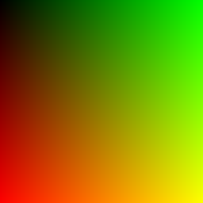

# Ray tracing

During the last year of my master degree I worked with ray tracing. I've forgotten all about it, and I needed a hobby project, so I'm looking into that area again.

This application is based on the pdf [Ray Tracing in a Weekend](https://raytracing.github.io/).

## Images
I include example images here, created with the application.

The first:



## A functional approach
I have been looking into functional programming (FP) recently, first in C#, and then F#. So I wanted to apply some of those ideas and principles. 
I am not necessarily all that interested in the immutable data part of FP, or monads, or all kinds of higher order functions, but I feel that an FP approach often makes your code simpler to read, and more "fluent". I do enjoy that.

#### Functional code organization.

What you will find is a lot of static classes, with static methods (functions). There are no classes. All data is kept in record types.\
Pure functions work only with their input, and provide an output. They don't use field variables from a class they belong to. They don't modify field variables. Therefore, they can be made static.\
I consider these static classes like _modules_ in F#, i.e. they are just a grouping of functions. 

Some files will define a record, and then below a static class containing functions, which can operate on this record, in some way.

This is very different from the usual OOP approach, where you create instances of classes, and these classes have data and properties, and methods to operate on the data.

There are no interfaces, instead function signatures are used whenever I need an interface-like abstraction.

## Functional Core / Mutable Shell
This is an architectural approach, I can't find all that much concrete information about. It seems most of my books mention it one way or another, without specifying the name.\
The idea is just that you have most of your logic in the "core", which will be as pure FP as possible.\
Then you have the shell, where you have the impure stuff, i.e. file-access, or user input. "Push the impure stuff to the edge of your system".

At the time of writing both PPM and PNG image export is in the shell, because they write to a file. However, I'm considering moving those libraries to the core, because only a very small part of the libraries do the writing. The bulk of the code is close-to-pure FP, working with data transformation. So I could instead inject a function for the file-writing part. I will eventually look into this.

## Name your expressions and prose-code
I have attempted to apply the "Name your expressions" approach, I heard Zoran Horvat mention [in one of his vidoes](https://www.youtube.com/watch?v=hC87MbFoRR0). 
Essentially this idea is to do a lot of "extract single/more statement(s) into separate function", so that you can give that function a descriptive name. Instead of understanding what the statement does, you can now read the name.
It's a kind of abstraction. It's a basic refactoring technique, called ["extract function"](https://refactoring.com/catalog/extractFunction.html).

The idea is just to organize your code into separate chunks, with one side-effect usually being an increase in readability, and you spend less time actually trying to understand what is going on.

Below is an example of how I export my image to a png file, first the main part:

```csharp
public static void ExportImageToPngFile(Image image, string path) =>
    CreateEmptyBitmap(image)
        .Then(MapImageOntoBitmap(image))
        .Finally(SaveBitmapToPng(path));
```

See how you can read this as:
* Create an empty bitmap
* Then map the image onto the bitmap (the Image is my own type)
* And finally the save the bitmap to png.

`Then()` and `Finally` are "mapping" functions, an idea from functional programming. The implementations are in Core/Tooling/BaseExtentions.

The "main-function" is then supported by a bunch of single-expression-functions. For example:

```csharp
private static Bitmap CreateEmptyBitmap(Image image) =>
    new(image.Width, image.Height);

private static Color PixelToColor(Pixel pixel) =>
    Color.FromArgb(
        (int)(pixel.R * 255.999f),
        (int)(pixel.G * 255.999f),
        (int)(pixel.B * 255.999f)
    );
```

Tiny functions, where the function name should be explanatory enough to know what is going on, without really having to dig into the code. Yes, it may be overkill to extraction the creation of a new Bitmap into a separate function. But this does allow me to hide the details of the creation, and instead write code which explains _what_ happens, rather than _how_ it happens. The same applies to the function which converts my Pixel to a Color.

The name-your-expressions approach also results in me having a lot of functions, which returns other functions (or actions). This is to make the main function even more readable. But a function returning a function perhaps looks weird, so it's a bit of a trade-off, I haven't entirely decided on whether I like or not.\
Now, a function returning a function is certainly not unheard of in FP, but the way I use it here is not something I have seen elsewhere. Which may indicate it's not a fantastic idea, but I will give this approach a shot, and eventually, perhaps, evaluate on the idea.

Here's an example, with the main function again, and a helper function-returning-a-function:

```csharp
public static void ExportImageToPngFile(Image image, string path) =>
    CreateEmptyBitmap(image)
        .Then(MapImageOntoBitmap(image))
        .Finally(SaveToPng(path));

private static Func<Bitmap, Bitmap> MapImageOntoBitmap(Image image) =>
    bmp => TransferPixelsFromImageToBitMap(image, bmp);
```

If I changed the `MapImageOntoBitmap` function to be a "normal" function, it would instead look like this

```csharp
public static void ExportImageToPngFile(Image image, string path) =>
    CreateEmptyBitmap(image)
        .Then(bmp => MapImageOntoBitmap(image, bmp))
        .Finally(SaveToPng(path));

private static Bitmap MapImageOntoBitmap(Image image, Bitmap bmp) =>
    TransferPixelsFromImageToBitMap(image, bmp);
```

Notice how the `Then(...)` part now takes a lambda expression instead, and pass the input parameter to the `MapImageOntoBitmap`. 
This is probably perfectly fine, but I feel that abstracting the lambda expression away makes the `Then(...)` part just slightly more readable:

* .Then(MapImageOntoBitmap(image)
* vs
* .Then(bmp => MapImageOntoBitmap(image, bmp))
 
It is a kind of "partial application", though used differently from the usual examples, I guess.

Here is another example, this is the state of the path tracer at the time of writing:

```csharp
public static void Render(Image image, Camera camera) =>
    GenerateXYCoordinates(image.Width, image.Height)
        .Then(CalculatePixelCenter(camera))
        .Then(CreateRayFromCamCenterToPixelCenter(camera))
        .Then(CalculateRayHitColor(camera))
        .Then(CombineColorAndIndex())
        .ForEach(SetColorOnImage(image));
```

Again, you should be able to read this as a series of steps, which are quite high-level. The details are hidden in the functions, which are named to explain what they do.\
In this case, however, it is perhaps a bit hidden that all the Then steps happen for each x,y pair. But I think it's still quite readable.
